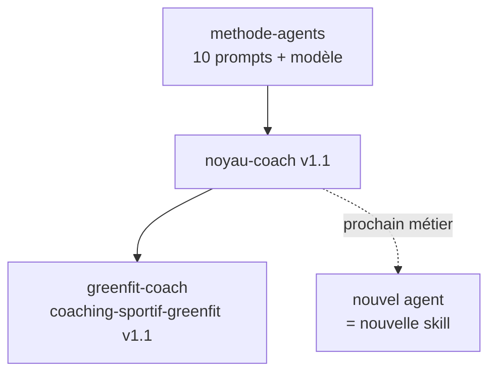

# Agents IA sur Claude

Des agents IA spécialisés, construits avec une méthode commune : **un noyau stable, des métiers interchangeables**. Chaque dépôt contient un agent ; la méthode et le modèle de départ sont dans [methode-agents](https://github.com/Electro-agents/methode-agents).

| Dépôt | Rôle | État |
| --- | --- | --- |
| [methode-agents](https://github.com/Electro-agents/methode-agents) | Suite de 10 prompts, architecture mutable, modèle de nouvel agent | Stable |
| [greenfit-coach](https://github.com/Electro-agents/greenfit-coach) | GREENFIT AI, coach sportif | Prompts 0 à 9 exécutés · évals complètes à lancer |

**Principes** : le système le plus simple qui atteint les critères · stable au début, variable à la fin (cache) · le calcul reste en code · aucun changement sans évals · jamais la triade létale.

**Ajouter un agent** : copier `methode-agents/modele-agent` dans un nouveau dépôt, puis lancer le prompt 0 avec le métier visé.
